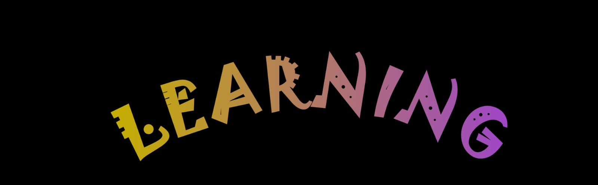

# Trivia de colores en inglés

Esta pagina permite a usuarios mas pequeños mas pequeños junto con su apoderado aprender algunos colores en ingles e identificarlo a traves de imagenes.
Aprender los colores en inglés es la forma idónea para que los peques comiencen a formar su personalidad y sus gustos, lo que apoyará su individualidad en el futuro. Para hacer más fácil su aprendizaje.

¿Por qué es importante que los niños aprendan los colores?
Aprender las figuras y los colores les enseñan a los niños a pensar sobre los atributos de los objetos y a hacer observaciones sobre similitudes y diferencias – lo cual ayuda a desarrollar el pensamiento lógico que necesitarán para solucionar problemas.

## Logo

## Color Reference

| Color             | Hex                                                                |
| ----------------- | ------------------------------------------------------------------ |
| Text Color |  #4985df| 
| Text Color |  #D0D33D| 
| Text Color |  #F97777 |
| Background Color |  #FFFFFF |

## Screenshots

![Prototype figma]

## Demo Figma Prototype

https://www.figma.com/proto/kelC2eCIn05SLhvCJ9Rcuy/Trivia?node-id=1-2&scaling=scale-down&page-id=0%3A1&starting-point-node-id=1%3A2

## Authors

- [@jhosefin](https://github.com/jhosefin)
